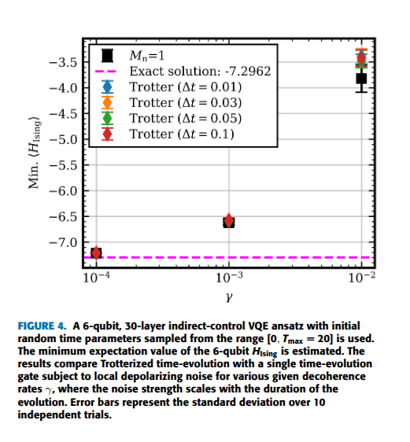
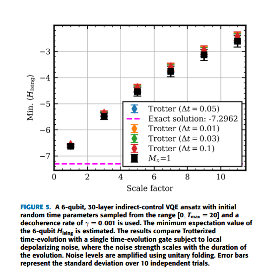
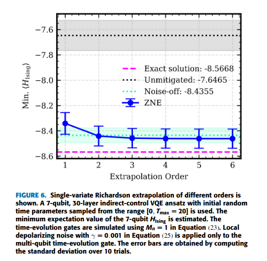
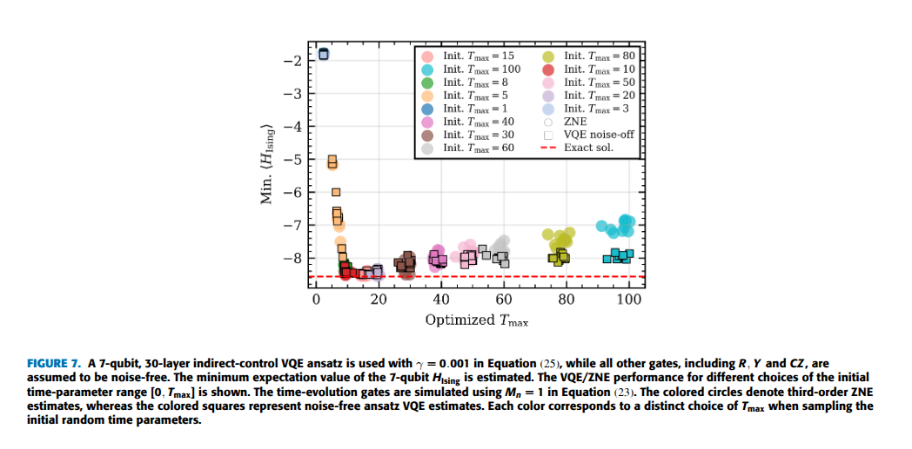
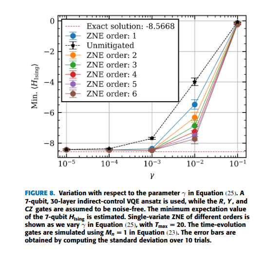
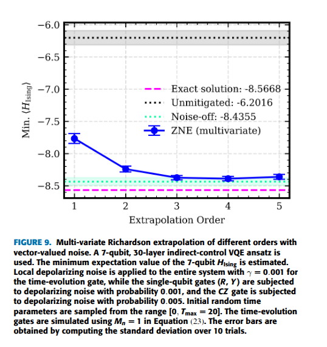

# About

Experimental findings can be found in this directory.

# Link Table

The relevant links for different experiments are compiled in the table below.


|Description|Link  |
|--|--|
|  |[Jupyter notebook](recent/experiment16[time-depol-trotter-vs-standard]/experiment16[time-depol-trotter-vs-standard].ipynb), [Raw data (JSON)](recent/experiment16[time-depol-trotter-vs-standard]/data/) |
| |[Jupyter notebook](recent/experiment12[time-depol-time-evo-noisy_p1e-3_tmax_various]/experiment12[time-depol-time-evo-noisy_p1e-3_tmax_various].ipynb), [Raw data (JSON)](recent/experiment12[time-depol-time-evo-noisy_p1e-3_tmax_various]/data/)|
||[Jupyter notebook](recent/experiment15[depol-time-evo-noisy_tmax_20_various_p]/experiment15[depol-time-evo-noisy_tmax_20_various_p].ipynb), [Raw data (JSON)](recent/experiment15[depol-time-evo-noisy_tmax_20_various_p]/data/)|
||[Jupyter notebook](recent/experiment14[depol-time-evo-noisy_variousorderzne_tmax_20]/experiment14[depol-time-evo-noisy_variousorderzne_tmax_20].ipynb), [Raw data (JSON)](recent/experiment14[depol-time-evo-noisy_variousorderzne_tmax_20]/data/)|

<!-- |Description|Link  |
|--|--|
| Plot 1: Single-variate Richardson extrapolation of different orders are shown. Depolarizing noise is applied only to the multi-qubit time-evolution gate. |[Jupyter notebook](recent/experiment12[time-depol-time-evo-noisy_p1e-3_tmax_various]/experiment12[time-depol-time-evo-noisy_p1e-3_tmax_various].ipynb), [Raw data (JSON)](recent/experiment12[time-depol-time-evo-noisy_p1e-3_tmax_various]/data), [Reproduce](recent/experiment12[time-depol-time-evo-noisy_p1e-3_tmax_various]/reproduce/) |
|Plot 2: VQE/ZNE performance for different choices of the initial time parameter upper bound $T_{\text{max}}$.| [Jupyter notebook](recent/experiment12[time-depol-time-evo-noisy_p1e-3_tmax_various]/experiment12[time-depol-time-evo-noisy_p1e-3_tmax_various].ipynb), [Raw data (JSON)](recent/experiment12[time-depol-time-evo-noisy_p1e-3_tmax_various]/data), [Reproduce](recent/experiment12[time-depol-time-evo-noisy_p1e-3_tmax_various]/reproduce/) |
|Plot 3: Single-variate ZNE of different orders vs $\Delta p$.|[Jupyter notebook](recent/experiment15[depol-time-evo-noisy_tmax_20_various_p]/experiment15[depol-time-evo-noisy_tmax_20_various_p].ipynb), [Raw data (JSON)](recent/experiment15[depol-time-evo-noisy_tmax_20_various_p]/data/), [Reproduce](recent/experiment15[depol-time-evo-noisy_tmax_20_various_p]/reproduce/)|
|Plot 4: Multivariate ZNE|[Jupyter notebook](recent/experiment14[depol-time-evo-noisy_variousorderzne_tmax_20]/experiment14[depol-time-evo-noisy_variousorderzne_tmax_20].ipynb), [Raw data (JSON)](recent/experiment14[depol-time-evo-noisy_variousorderzne_tmax_20]/data/), [Reproduce](recent/experiment14[depol-time-evo-noisy_variousorderzne_tmax_20]/reproduce/)| -->

# Reproducing

- The Jupyter notebooks can be used to reproduce the plots, which read the available raw experimental JSON data.
- One can reproduce the raw data by running the Python scripts (unfortunately we have many scripts) as outlined below. However, it requires additional configuration file setup.


# Indirect-Control VQE and ZNE Error Mitigation: How to Use the Code

Download the code from [here](https://github.com/arijit-ship/indirect-zne/releases/tag/reproducing-results).

## 🛠️ Installation

- **Python Version:** `3.11`  
- To install dependencies on Ubuntu (Linux), run:  
```bash
  pip install -r requirements.txt
```
- On Windows, install minimum dependencies via:
```bash
  pip install -r requirements.winmin.txt
```
## ⚙️ Usage

The `main.py` is used for VQE optimization, redundant circuit runs, and finally performing ZNE.

To run the program, use:  
```bash
  python3 main.py <config.yml>
```

`<config.yml>` needs to set-up properly for each kind of `run`.

A faster multi-core script can alternatively be run for VQE optimization (the redundant circuit run and ZNE can be done using `main.py`):
```bash
  python3 vqe-mcore.py <config.yml>
```
Additionally, there is an automation script `automate2.py` that can automate the redundant circuit run and ZNE.

⚠️ WARNING: 7-qubit, 30-layer VQE optimization can take a significant amount of time.

## 📋 Sample Configuration File

([Sample experimental config files](../config_samples/))

```yaml
# Run configurations: Choose from 'vqe', 'redundant', and 'zne'.
run: "vqe"

# System configuration
nqubits: 7
# State options: 'dmatrix' and 'statevector'
state: "dmatrix"

# Output configuration
output:
  file_name_prefix: "xy_ansatz_time_depol_tmax_100" #1, 3, 5, 8, 10, 15, (20), 30, 40, 50, 60, 80, 100
  draw:
    status: False
    fig_dpi: 100
    type: "png"

# Target Hamiltonian configuration
observable:
  # Definition options: 'custom', 'ising', or 'heisenberg'.
  # 'custom' and 'ising' are created using a Hamiltonian with terms XZ-Z (this is NOT any standard familier XY model, we call it 'Fancy XY-model Hamiltonian').
  def: "ising"

  # WARNING: Coefficients can be overwritten:
  # 'custom': Not overwritten.
  # 'ising': cn, bn, r are overwritten to [0.5], [1], 1.
  # 'heisenberg': Only cn is used (will NOT be overwritten); bn and r are not used.
  coefficients:
    cn: [0.5, 0.5, 0.5, 0.5, 0.5, 0.5]
    bn: [1.0, 1.0, 1.0, 1.0, 1.0, 1.0, 1.0]
    r: 1

# Circuit configuration
ansatz:
  layer: 30
  # Not tested. Keep gateset=1, there could be bugs.
  gateset: 1
  ugate:
    # Type options: 'custom', 'xy-iss', 'ising', and 'heisenberg'.
    # 'custom' and 'ising' are created using a Hamiltonian with terms XZ-Z (this is NOT any standard familier XY model, we call it 'Fancy XY-model Hamiltonian').
    type: "xy-iss"
    # WARNING: For ZNE redundant circuit, the ansatz type must be 'xy-iss' (stands for XY identity-scaling-supported).
    
    coefficients:
    # WARNING: Coefficients can be overwritten:
    # 'custom': Not overwritten.
    # 'xy-iss': cn, bn, r are overwritten to [0.5], [0], 0.
    # 'ising': cn, bn, r are overwritten to [0.5], [1], 1.
    # 'heisenberg': Only cn is used (will NOT be overwritten); bn and r are not used.
      cn: [0.5, 0.5, 0.5, 0.5, 0.5, 0.5]
      bn: [0, 0, 0, 0, 0, 0, 0]
      r: 0
    time:
      min: 0.0
      max: 100

# Variational Quantum Eigensolver (VQE) configuration
vqe:
  iteration: 10
  # Optimization configuration
  optimization:
    status: True
    algorithm: "SLSQP"
    constraint: True

# Initial parameters for the ansatz.
init_param:
  # Parameter value: "random" or "List[floats]".
  value: "random"

# Noise configuration
noise_profile:
  status: False
  type: "time-depol" # Choose from 'depolarizing', 'bitflip', 'dephasing', or 'xznoise'.
  noise_prob: [0, 0, 0.001, 0.0] # Noise probabilities for [R, CZ, U, Y] gates.
  noise_on_init_param:
    # NOT IMPLEMENTED! Adds noise to the initial parameters.
    status: False
    value: 0

# Redundant circuit configuration
redundant:
  # Identity factors for [R, CZ, U, Y] gates.
  # WARNING: Identity scaling for the U gate is only possible if vqe.ansatz.type is 'xy-iss'. For other types, the identity factor for the U gate must be set to 0.
  identity_factors: [[0, 0, 0, 0], [1, 1, 1, 1]]

# Zero noise extrapolation (ZNE) configuration
zne:
  # Method options: 'linear', 'polynomial', 'richardson', or 'richardson-mul'.
  # 'linear' and 'polynomial' use scikit-learn for regression.
  method: "richardson"

  # Degree is only applicable for 'polynomial' and 'richardson-mul'. The 'richardson' method does not accept degree as a parameter.
  degree: 1

  # Sampling method options: 'default', 'default-N', or 'random-N', where N is an integer.
  # 'default' - samples all points.
  # 'default-N' - samples the first N points.
  # 'random-N' - samples N points randomly.
  sampling: "default"

  # Data points for extrapolation
  data_points:  
  ```