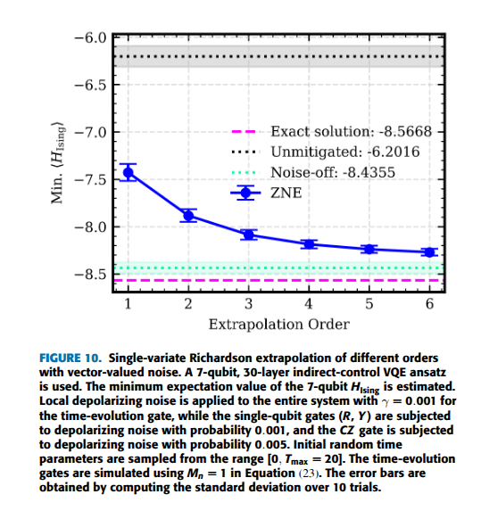
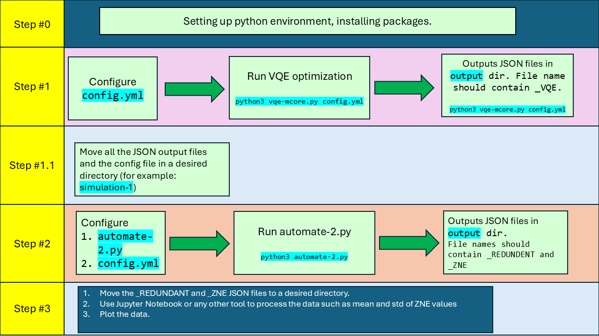

# About

Experimental findings can be found in this directory.

# Link Table

The relevant links for different experiments are compiled in the table below. Usually a single Jupyter notebook has multiple figures, please the find the figure correctly.


|Description|Link  |
|--|--|
|  |[Jupyter notebook](recent/experiment16[time-depol-trotter-vs-standard]/experiment16[time-depol-trotter-vs-standard].ipynb), [Raw data (JSON)](recent/experiment16[time-depol-trotter-vs-standard]/data/) |
| |[Jupyter notebook](recent/experiment12[time-depol-time-evo-noisy_p1e-3_tmax_various]/experiment12[time-depol-time-evo-noisy_p1e-3_tmax_various].ipynb), [Raw data (JSON)](recent/experiment12[time-depol-time-evo-noisy_p1e-3_tmax_various]/data/)|
||[Jupyter notebook](recent/experiment15[depol-time-evo-noisy_tmax_20_various_p]/experiment15[depol-time-evo-noisy_tmax_20_various_p].ipynb), [Raw data (JSON)](recent/experiment15[depol-time-evo-noisy_tmax_20_various_p]/data/)|
||[Jupyter notebook](recent/experiment14[depol-time-evo-noisy_variousorderzne_tmax_20]/experiment14[depol-time-evo-noisy_variousorderzne_tmax_20].ipynb), [Raw data (JSON)](recent/experiment14[depol-time-evo-noisy_variousorderzne_tmax_20]/data/)|
||[Jupyter notebook](recent/experiment14[depol-time-evo-noisy_variousorderzne_tmax_20]/experiment14[depol-time-evo-noisy_variousorderzne_tmax_20].ipynb)|

<!-- |Description|Link  |
|--|--|
| Plot 1: Single-variate Richardson extrapolation of different orders are shown. Depolarizing noise is applied only to the multi-qubit time-evolution gate. |[Jupyter notebook](recent/experiment12[time-depol-time-evo-noisy_p1e-3_tmax_various]/experiment12[time-depol-time-evo-noisy_p1e-3_tmax_various].ipynb), [Raw data (JSON)](recent/experiment12[time-depol-time-evo-noisy_p1e-3_tmax_various]/data), [Reproduce](recent/experiment12[time-depol-time-evo-noisy_p1e-3_tmax_various]/reproduce/) |
|Plot 2: VQE/ZNE performance for different choices of the initial time parameter upper bound $T_{\text{max}}$.| [Jupyter notebook](recent/experiment12[time-depol-time-evo-noisy_p1e-3_tmax_various]/experiment12[time-depol-time-evo-noisy_p1e-3_tmax_various].ipynb), [Raw data (JSON)](recent/experiment12[time-depol-time-evo-noisy_p1e-3_tmax_various]/data), [Reproduce](recent/experiment12[time-depol-time-evo-noisy_p1e-3_tmax_various]/reproduce/) |
|Plot 3: Single-variate ZNE of different orders vs $\Delta p$.|[Jupyter notebook](recent/experiment15[depol-time-evo-noisy_tmax_20_various_p]/experiment15[depol-time-evo-noisy_tmax_20_various_p].ipynb), [Raw data (JSON)](recent/experiment15[depol-time-evo-noisy_tmax_20_various_p]/data/), [Reproduce](recent/experiment15[depol-time-evo-noisy_tmax_20_various_p]/reproduce/)|
|Plot 4: Multivariate ZNE|[Jupyter notebook](recent/experiment14[depol-time-evo-noisy_variousorderzne_tmax_20]/experiment14[depol-time-evo-noisy_variousorderzne_tmax_20].ipynb), [Raw data (JSON)](recent/experiment14[depol-time-evo-noisy_variousorderzne_tmax_20]/data/), [Reproduce](recent/experiment14[depol-time-evo-noisy_variousorderzne_tmax_20]/reproduce/)| -->

# Reproducing

- The Jupyter notebooks can be used to reproduce the plots, which read the available raw experimental JSON data.
- One can reproduce the raw data by running the Python scripts (unfortunately we have many scripts) as outlined below. However, it requires additional configuration file setup.


# Indirect-Control VQE and ZNE Error Mitigation: How to Use the Code

Download the code from [here](https://github.com/arijit-ship/indirect-zne/releases/tag/reproducing-results).

## 🛠️ Installation

- **Python Version:** `3.11`  
- To install dependencies on Ubuntu (Linux), run:  
```bash
  pip install -r requirements.txt
```
- On Windows, install minimum dependencies via:
```bash
  pip install -r requirements.winmin.txt
```
## ⚙️ Usage

The `main.py` is used for VQE optimization, redundant circuit runs, and finally performing ZNE.

To run the program, use:  
```bash
  python3 main.py <config.yml>
```

`<config.yml>` needs to set-up properly for each kind of `run`.

A faster multi-core script can alternatively be run for VQE optimization (the redundant circuit run and ZNE can be done using `main.py`):
```bash
  python3 vqe-mcore.py <config.yml>
```
Additionally, there is an automation script `automate2.py` that can automate the redundant circuit run and ZNE.

All data for the plots presented in the table were produced using `vqe-mcore.py` 
for VQE optimizations, and `automate2.py` was used to automatically run folded 
circuits and perform ZNE.

Additional support can be provided if a reviewer wishes to reproduce any result 
from scratch.

⚠️ WARNING: 7-qubit, 30-layer VQE optimization can take a significant amount of time.



## 📋 Configuring YAML File

([Sample experimental config files](../config_samples/))

```yaml
run: "vqe"

nqubits: 7
state: "dmatrix"

output:
  #When running VQE, the generated JSON file name ends with <file_name_prefix>..._VQE.JSON
  file_name_prefix: "xy_ansatz_time_depol_tmax_100" 
  draw:
    status: False
    fig_dpi: 100
    type: "png"

observable:
  def: "ising"
  # Coefficients are overwritten iside the code. You can scheck the actual Hamiltonian string inside JSON output files.
  # Dont leave them blank
  coefficients:
    cn: [0.5, 0.5, 0.5, 0.5, 0.5, 0.5]
    bn: [1.0, 1.0, 1.0, 1.0, 1.0, 1.0, 1.0]
    r: 1

ansatz:
  layer: 30
  gateset: 1
  ugate:
    type: "xy-iss"
    # Coefficients are overwritten iside the code. You can scheck the actual Hamiltonian string inside JSON output files.
    # Dont leave them blank
    coefficients:
      cn: [0.5, 0.5, 0.5, 0.5, 0.5, 0.5]
      bn: [0, 0, 0, 0, 0, 0, 0]
      r: 0
    time:
      min: 0.0
      max: 20  # HYPER PARAMETER

vqe:
  iteration: 10 # 10 independent samples to calculate mean and std
  optimization:
    status: True
    algorithm: "SLSQP"
    constraint: True

init_param:
  value: "random"

noise_profile:
  status: True
  # [THIS PARAMETER NEEDS ATTENTION]
  type: "time-depol"  #or, set it to time-depol-totter
  noise_prob: [0, 0, 0.001, 0.0]  # [R, CZ, U, Y] respectively. For U gate it acts as gamma.
  noise_on_init_param:
    status: False
    value: 0

redundant:
  identity_factors: [[0, 0, 0, 0], [1, 1, 1, 1]]

zne:
  method: "richardson" # When doing multivariate, change it to "ric-mul"
  degree: 1
  sampling: "default"
  data_points:
  ```