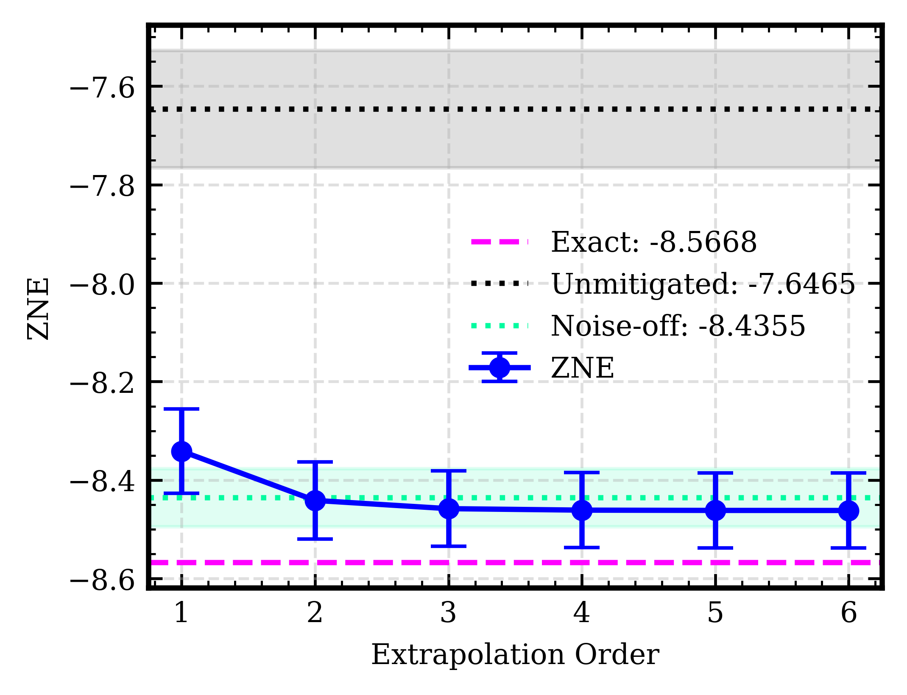
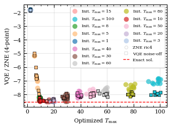
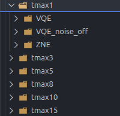
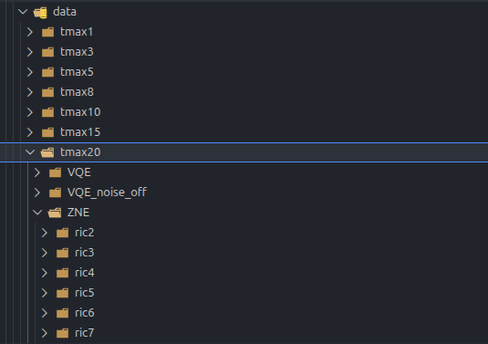
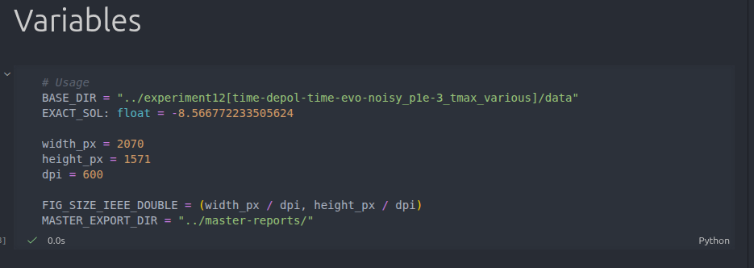
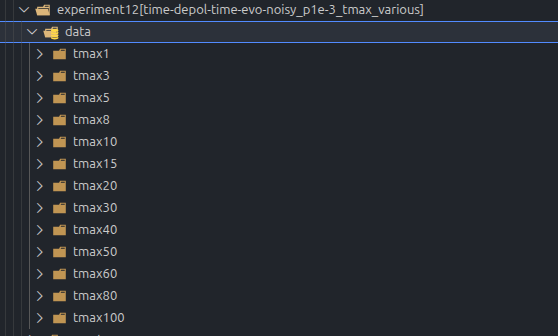
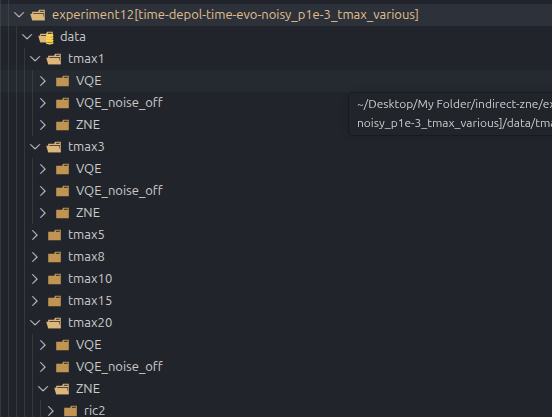
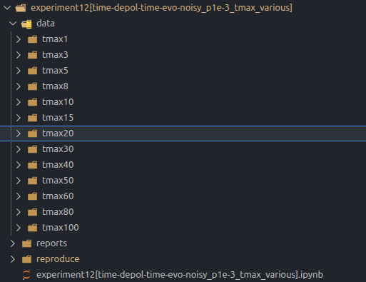
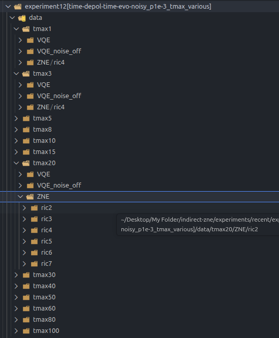

# Reproducing the Experiment




This guide walks you through the steps to reproduce the simulation data for this experiment. The pipeline has three sequential stages that must be run **in order**:

```
VQE  →  Redundant & ZNE  →  Plotting
```

Each stage depends on the output of the previous one.

---

## 1. Setup

### Download

Download the [v2.0 release](https://github.com/arijit-ship/indirect-zne/releases/tag/v2.0) of the repository.

### Requirements

- **Python 3.11**
- Install dependencies based on your OS:

  **Linux (Ubuntu)**
  ```bash
  pip install -r requirements.txt
  ```

  **Windows**
  ```bash
  pip install -r requirements.winmin.txt
  ```

---


## 2. Pipeline

### Stage 1 — VQE

The VQE stage must be run separately for each value in the following list:

```
[1, 3, 5, 8, 10, 15, 20, 30, 40, 50, 60, 80, 100]
```

Each value corresponds to `ansatz.ugate.time.max` in `config.yml`. We will refer to this as `Tmax`.

#### 2.1 Run VQE (with noise)

1. Open `config.yml` and set **one value at a time** for `ansatz.ugate.time.max`. For example:
   ```yaml
   ansatz:
     ugate:
       time:
         max: 20
   ```

2. Run the VQE script:
   ```bash
   python3 vqe-mcore.py config.yml
   ```
   > **Note:** Make sure the path to `config.yml` is correctly specified.

3. This produces **10 JSON output files** in the `output/` folder. The experiment is repeated 10 times to compute mean and standard deviation.

> ⏳ **Warning:** VQE can take a significant amount of time depending on your hardware.

#### 2.2 Run VQE (noise-free)

Repeat steps 1–3 above for each value in the list, but with noise disabled in `config.yml`:

```yaml
noise_profile:
  status: False
```

This also produces 10 JSON files per `Tmax` value.

#### 2.3 Organize Output Files

For each `Tmax`, create a directory with the following structure.

**For all Tmax values except `tmax20`:**
```
tmax<N>/
├── VQE/              ← noisy VQE results (10 JSON files)
├── VQE_noise_off/    ← noise-free VQE results (10 JSON files)
└── ZNE/
    └── ric4/         ← populated in Stage 2
```



**For `tmax20` only** (multiple ZNE orders are run for this value):
```
tmax20/
├── VQE/
├── VQE_noise_off/
└── ZNE/
    ├── ric2/         ← 2-point ZNE (order 1)
    ├── ric3/         ← 3-point ZNE (order 2)
    ├── ric4/         ← 4-point ZNE (order 3)
    ├── ric5/         ← 5-point ZNE (order 4)
    ├── ric6/         ← 6-point ZNE (order 5)
    └── ric7/         ← 7-point ZNE (order 6)
```



Copy the 10 noisy JSON files into `VQE/` and the 10 noise-free JSON files into `VQE_noise_off/` for each directory.

---

### Stage 2 — Redundant & ZNE

Once all VQE JSON files are organized, the Redundant and ZNE steps can be run together using the `automate2.py` script.

This stage is run once per `Tmax` for most values, but **multiple times for `tmax20`** (once per ZNE order). Each run processes one `Tmax` at a time.

#### Configure `automate2.py`

Open `automate2.py` and set the parameters at the top of the file (just after the imports):

```python
# === CONFIGURATION ===

# Path to the VQE/ directory for the current Tmax
RAW_DATA_FOLDER = "PATH/TO/tmax<N>/VQE/"

# Model name — do not change
model: str = "xy-iss"
ANSATZ_TYPE = model

# Prefix for output file names — use something descriptive
STATIC_PREFIX = f"EXPERIMENT_DESCRIPTION_{model}_ric4point"

# Richardson ZNE folding factors applied to [R, CZ, U, Y] gates respectively.
# Since only the time-evolution gate (U) is noisy, only its factor is incremented.
#
# Keep the first N+1 rows for an N-order (i.e. (N+1)-point) ZNE; comment the rest.
# For all Tmax values, use 4-point ZNE (order 3) — keep the first 4 rows:
I_FACTOR = [
    [0, 0, 0, 0],
    [0, 0, 1, 0],
    [0, 0, 2, 0],
    [0, 0, 3, 0],
    # [0, 0, 4, 0],
    # [0, 0, 5, 0],
    # [0, 0, 6, 0],
]

# Path to the config.yml used to generate the VQE JSON files
CONFIG_PATH = "PATH/TO/config.yml"

# Keep False — we are performing single-variate ZNE only
RIC_MUL = False
```

#### Run and collect output

Run the script:

```bash
python3 automate2.py
```

Each run produces **20 JSON files** in the `output/` folder — 10 redundant circuit results and their 10 corresponding ZNE results. Copy these into the appropriate `ZNE/ricN/` subdirectory for that `Tmax`.

#### For `tmax20`: repeat for each ZNE order

For `tmax20`, re-run `automate2.py` six times (once per ZNE order), adjusting `I_FACTOR` each time, and copy each run's output to the corresponding subfolder:

| Run | Rows kept in `I_FACTOR` | Copy JSON files to |
|-----|-------------------------|--------------------|
| 1   | First 2 rows            | `ZNE/ric2/`        |
| 2   | First 3 rows            | `ZNE/ric3/`        |
| 3   | First 4 rows            | `ZNE/ric4/`        |
| 4   | First 5 rows            | `ZNE/ric5/`        |
| 5   | First 6 rows            | `ZNE/ric6/`        |
| 6   | All 7 rows              | `ZNE/ric7/`        |

#### Iterate over all Tmax values

After completing each `Tmax`, update `RAW_DATA_FOLDER` to point to the next directory and repeat:

```python
RAW_DATA_FOLDER = "PATH/TO/tmax<next_N>/VQE/"
```

---

### Stage 3 — Plotting

Once all JSON files are in place, use the provided Jupyter notebook to process and plot the data. The notebook computes the mean and standard deviation across the 10 VQE and ZNE samples for each `Tmax`.

Download and open the [notebook](../experiment12[time-depol-time-evo-noisy_p1e-3_tmax_various].ipynb) and set the `BASE_DIR` variable to the root directory containing all `tmax<N>/` folders:

```python
BASE_DIR = "PATH/TO/data/"   # directory that contains tmax5/, tmax8/, tmax10/, ...
```





Then run all cells to generate the plots.

---

## Reference: Full Project Tree

The screenshots below show the expected project structure after all stages are complete.







---

## Summary Checklist

- [ ] Downloaded v2.0 release
- [ ] Installed dependencies
- [ ] For each `Tmax` in `[1, 3, 5, 8, 10, 15, 20, 30, 40, 50, 60, 80, 100]`:
  - [ ] Run noisy VQE → copy 10 JSONs to `VQE/`
  - [ ] Run noise-free VQE → copy 10 JSONs to `VQE_noise_off/`
  - [ ] Run `automate2.py` (4-point ZNE, order 3) → copy 20 JSONs to `ZNE/ric4/`
- [ ] For `tmax20` additionally, run `automate2.py` for the remaining ZNE orders:
  - [ ] Order 1 (2-point) → copy 20 JSONs to `ZNE/ric2/`
  - [ ] Order 2 (3-point) → copy 20 JSONs to `ZNE/ric3/`
  - [ ] Order 4 (5-point) → copy 20 JSONs to `ZNE/ric5/`
  - [ ] Order 5 (6-point) → copy 20 JSONs to `ZNE/ric6/`
  - [ ] Order 6 (7-point) → copy 20 JSONs to `ZNE/ric7/`
- [ ] Set `BASE_DIR` in the Jupyter notebook and run all cells to generate plots