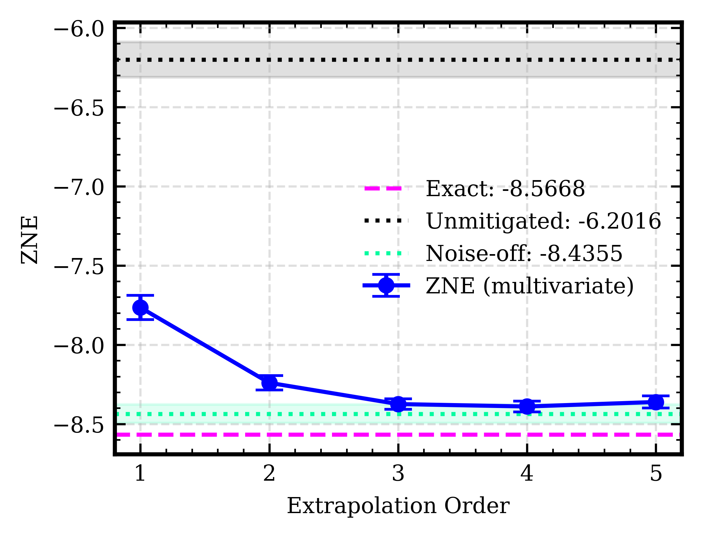
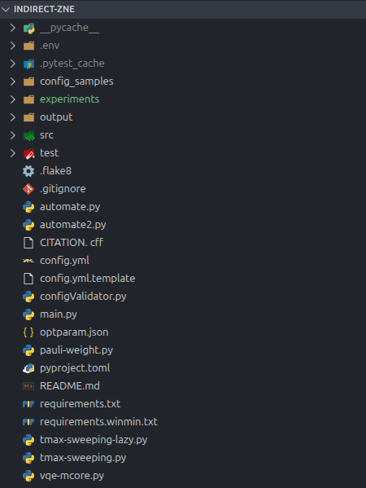
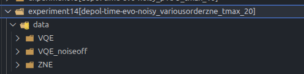

# Reproducing the Experiment



This guide walks you through the steps to reproduce the simulation data for this experiment. The pipeline has three sequential stages that must be run **in order**:

```
VQE  →  Redundant & ZNE  →  Plotting
```

Each stage depends on the output of the previous one.

---

## 1. Setup

### Download

Download the [v2.0 release](https://github.com/arijit-ship/indirect-zne/releases/tag/v2.0) of the repository.

### Requirements

- **Python 3.11**
- Install dependencies based on your OS:

  **Linux (Ubuntu)**
  ```bash
  pip install -r requirements.txt
  ```

  **Windows**
  ```bash
  pip install -r requirements.winmin.txt
  ```

---

## 2. Pipeline

This experiment uses a fixed `Tmax = 20` throughout.

### Stage 1 — VQE

#### 2.1 Run VQE (with noise)

1. Download [config.reproduce2.yml](config.reproduce2.yml) and verify the following settings are present:
   ```yaml
   ansatz:
     ugate:
       time:
         max: 20

   noise_profile:
     status: True
     noise_prob: [0.001, 0.005, 0.001, 0.001]
   ```

2. Run the VQE script:
   ```bash
   python3 vqe-mcore.py config.reproduce2.yml
   ```
   > **Note:** Make sure the path to `config.reproduce2.yml` is correctly specified.

3. This produces **10 JSON output files** in the `output/` folder. The experiment is repeated 10 times to compute mean and standard deviation.



> ⏳ **Warning:** VQE can take a significant amount of time depending on your hardware.

#### 2.2 Run VQE (noise-free)

Repeat steps 1–3 above with noise disabled in the config file:

```yaml
noise_profile:
  status: False
```

This also produces 10 JSON files.

#### 2.3 Organize Output Files

Create the following directory structure under a `data/` folder:

```
data/
├── VQE/                    ← noisy VQE results (10 JSON files)
├── VQE_noiseoff/           ← noise-free VQE results (10 JSON files)
└── ZNE/
    ├── ZNE-mul-var/        ← multivariate ZNE (populated in Stage 2)
    │   ├── muld1/          ← degree 1
    │   ├── muld2/          ← degree 2
    │   ├── muld3/          ← degree 3
    │   ├── muld4/          ← degree 4
    │   └── muld5/          ← degree 5
    └── ZNE-single-var/     ← single-variate ZNE (populated in Stage 2)
        ├── ric2/           ← 2-point ZNE (order 1)
        ├── ric3/           ← 3-point ZNE (order 2)
        ├── ric4/           ← 4-point ZNE (order 3)
        ├── ric5/           ← 5-point ZNE (order 4)
        ├── ric6/           ← 6-point ZNE (order 5)
        └── ric7/           ← 7-point ZNE (order 6)
```



Copy the 10 noisy JSON files into `VQE/` and the 10 noise-free JSON files into `VQE_noiseoff/`.

---

### Stage 2 — Redundant & ZNE

Both ZNE variants are run using `automate2.py`. The two differ in the `RIC_MUL` flag and the `I_FACTOR` values.

---

#### 2a. Multivariate ZNE (`ZNE-mul-var`)

This is run **five times** — once per polynomial degree (`muld1` through `muld5`). For each run, `I_FACTOR` must be freshly computed, then pasted into `automate2.py`.

##### Step 1 — Compute `I_FACTOR` for the target degree

Run the following snippet, setting `d` to the target degree (1 through 5). `l` and `Delta` stay fixed across all runs:

```python
import math
from itertools import product as iproduct

l, Delta = 4, 1
d = 1  # ← set this to 1, 2, 3, 4, or 5 for each run

ms = [m for m in iproduct(range(d+1), repeat=l) if sum(m) <= d]
lambdas = [[1 + Delta*mi for mi in m] for m in ms]

require_point_gate_count_space = math.factorial((l-1) + d) // (
    math.factorial(l-1) * math.factorial(d)
)

I_FACTOR = [[0, 0, 0, 0], *lambdas[:len(lambdas)-1]][:require_point_gate_count_space]
print(I_FACTOR)  # copy this output into automate2.py
```

##### Step 2 — Configure `automate2.py`

Open `automate2.py` and set the parameters at the top of the file (just after the imports):

```python
# === CONFIGURATION ===

# Path to the noisy VQE JSON directory
RAW_DATA_FOLDER = "PATH/TO/data/VQE/"

# Model name — do not change
model: str = "xy-iss"
ANSATZ_TYPE = model

# Update the suffix to match the current degree, e.g. muld1, muld2, ...
STATIC_PREFIX = f"EXPERIMENT_DESCRIPTION_{model}_muld1"

# Paste the output of the I_FACTOR snippet here
I_FACTOR = [...]  # ← replace with computed value for current degree

# Path to the config file used to generate the VQE JSON files
CONFIG_PATH = "PATH/TO/config.reproduce2.yml"

# Must be True for multivariate ZNE
RIC_MUL = True
```

##### Step 3 — Run and collect output

```bash
python3 automate2.py
```

Each run produces **20 JSON files** in the `output/` folder — 10 redundant circuit results and their 10 corresponding ZNE results. Copy them to the matching degree subfolder:

| Degree (`d`) | Copy JSON files to        |
|--------------|---------------------------|
| 1            | `ZNE/ZNE-mul-var/muld1/`  |
| 2            | `ZNE/ZNE-mul-var/muld2/`  |
| 3            | `ZNE/ZNE-mul-var/muld3/`  |
| 4            | `ZNE/ZNE-mul-var/muld4/`  |
| 5            | `ZNE/ZNE-mul-var/muld5/`  |

Repeat Steps 1–3 for each degree, incrementing `d` and updating `STATIC_PREFIX` each time.

---

#### 2b. Single-variate ZNE (`ZNE-single-var`)

This is run **six times** — once per ZNE order (corresponding to `ric2` through `ric7`). The `I_FACTOR` here uses uniform folding across all gates except Y.

##### Configure `automate2.py`

Set the following in `automate2.py`. The only value that changes between runs is the number of uncommented rows in `I_FACTOR` and the `STATIC_PREFIX`:

```python
# === CONFIGURATION ===

RAW_DATA_FOLDER = "PATH/TO/data/VQE/"

model: str = "xy-iss"
ANSATZ_TYPE = model

# Update the suffix to match the current order, e.g. ric2, ric3, ...
STATIC_PREFIX = f"EXPERIMENT_DESCRIPTION_{model}_ric2"

# Keep the first N+1 rows for an N-order (i.e. (N+1)-point) ZNE; comment the rest.
# For example, for ric4 (order 3), keep the first 4 rows:
I_FACTOR = [
    [0, 0, 0, 0],
    [1, 1, 1, 0],
    [2, 2, 2, 0],
    [3, 3, 3, 0],
    # [4, 4, 4, 0],
    # [5, 5, 5, 0],
    # [6, 6, 6, 0],
]

CONFIG_PATH = "PATH/TO/config.reproduce2.yml"

# Must be False for single-variate ZNE
RIC_MUL = False
```

##### Run and collect output

```bash
python3 automate2.py
```

Each run produces **20 JSON files** in the `output/` folder. Copy them to the corresponding subfolder:

| Run | Rows kept in `I_FACTOR` | Copy JSON files to              |
|-----|-------------------------|---------------------------------|
| 1   | First 2 rows            | `ZNE/ZNE-single-var/ric2/`     |
| 2   | First 3 rows            | `ZNE/ZNE-single-var/ric3/`     |
| 3   | First 4 rows            | `ZNE/ZNE-single-var/ric4/`     |
| 4   | First 5 rows            | `ZNE/ZNE-single-var/ric5/`     |
| 5   | First 6 rows            | `ZNE/ZNE-single-var/ric6/`     |
| 6   | All 7 rows              | `ZNE/ZNE-single-var/ric7/`     |

---

### Stage 3 — Plotting

Once all JSON files are in place, use the provided Jupyter notebook to process and plot the data. The notebook computes the mean and standard deviation across the 10 VQE and ZNE samples.

Open the notebook and set the `BASE_DIR` variable to the `data/` directory:

```python
BASE_DIR = "PATH/TO/data/"
```

Then run all cells to generate the plots.

---

## Summary Checklist

- [ ] Downloaded v2.0 release
- [ ] Installed dependencies
- [ ] Run noisy VQE → copy 10 JSONs to `VQE/`
- [ ] Run noise-free VQE → copy 10 JSONs to `VQE_noiseoff/`
- [ ] Multivariate ZNE — for each degree `d` in 1–5:
  - [ ] Compute `I_FACTOR` with the snippet (set `d`)
  - [ ] Configure and run `automate2.py` (`RIC_MUL = True`)
  - [ ] Copy 20 JSONs to `ZNE/ZNE-mul-var/muldN/`
- [ ] Single-variate ZNE — for each order (ric2–ric7):
  - [ ] Configure and run `automate2.py` (`RIC_MUL = False`)
  - [ ] Copy 20 JSONs to `ZNE/ZNE-single-var/ricN/`
- [ ] Set `BASE_DIR` in the Jupyter notebook and run all cells to generate plots