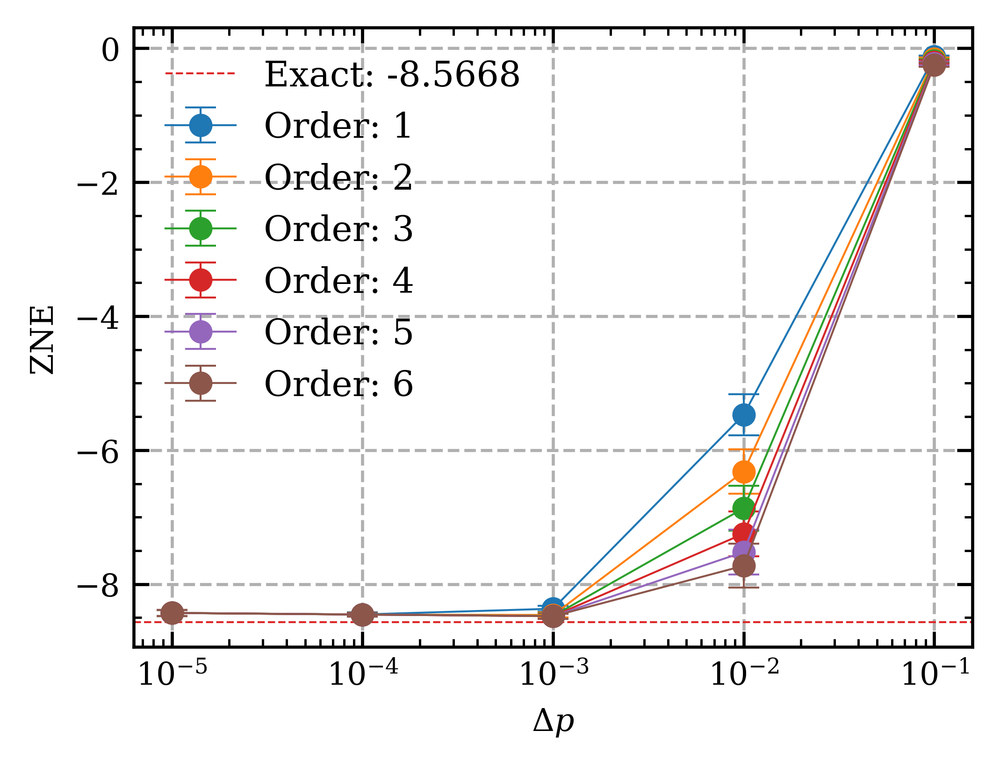
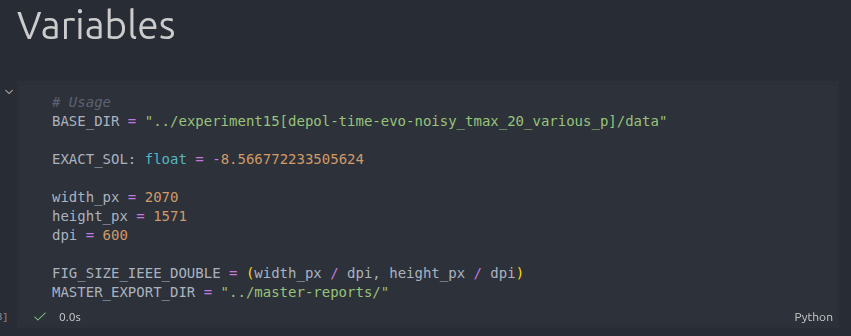

# Reproducing the Experiment



This guide walks you through the steps to reproduce the simulation data for this experiment. The pipeline has three sequential stages that must be run **in order**:

```
VQE  →  Redundant & ZNE  →  Plotting
```

Each stage depends on the output of the previous one.

---

## 1. Setup

### Download

Download the [v2.0 release](https://github.com/arijit-ship/indirect-zne/releases/tag/v2.0) of the repository.

### Requirements

- **Python 3.11**
- Install dependencies based on your OS:

  **Linux (Ubuntu)**
  ```bash
  pip install -r requirements.txt
  ```

  **Windows**
  ```bash
  pip install -r requirements.winmin.txt
  ```

---

## 2. Pipeline

This experiment uses a fixed `Tmax = 20` and sweeps the noise probability across five values:

```
noise_prob[2] ∈ [1e-1, 1e-2, 1e-3, 1e-4, 1e-5]
```

The full pipeline must be repeated for each noise level. The noise-free VQE run is shared across all noise levels and only needs to be done once.

### Stage 1 — VQE

#### 2.1 Organize Output Files

Before running anything, create the following directory structure under a `data/` folder:

```
data/
├── VQE_noiseoff/       ← noise-free VQE results, shared across all noise levels (10 JSON files)
├── p1e-1/              ← noise_prob[2] = 1e-1
│   ├── VQE/            ← noisy VQE results (10 JSON files)
│   └── ZNE/
│       ├── ric2/       ← 2-point ZNE (order 1)
│       ├── ric3/       ← 3-point ZNE (order 2)
│       ├── ric4/       ← 4-point ZNE (order 3)
│       ├── ric5/       ← 5-point ZNE (order 4)
│       ├── ric6/       ← 6-point ZNE (order 5)
│       └── ric7/       ← 7-point ZNE (order 6)
├── p1e-2/              ← noise_prob[2] = 1e-2  (same structure as p1e-1)
├── p1e-3/              ← noise_prob[2] = 1e-3
├── p1e-4/              ← noise_prob[2] = 1e-4
└── p1e-5/              ← noise_prob[2] = 1e-5
```


#### 2.2 Run VQE (noise-free) — once only

1. Download [config.reproduce3.yml](config.reproduce3.yml) and set noise disabled:
   ```yaml
   noise_profile:
     status: False
   ```

2. Run the VQE script:
   ```bash
   python3 vqe-mcore.py config.reproduce3.yml
   ```

3. This produces **10 JSON files** in the `output/` folder. Copy them to `data/VQE_noiseoff/`.

#### 2.3 Run VQE (with noise) — once per noise level

Repeat the following steps for each value in `[1e-1, 1e-2, 1e-3, 1e-4, 1e-5]`.

1. Open `config.reproduce3.yml` and set `noise_prob[2]` to the current noise level. The other three noise values stay fixed at zero:
   ```yaml
   ansatz:
     ugate:
       time:
         max: 20

   noise_profile:
     status: True
     noise_prob: [0.0, 0.0, 1e-1, 0.0]   # ← update the third value each run
   ```

2. Run the VQE script:
   ```bash
   python3 vqe-mcore.py config.reproduce3.yml
   ```
   > **Note:** Make sure the path to `config.reproduce3.yml` is correctly specified.

3. This produces **10 JSON files** in the `output/` folder. Copy them to the `VQE/` subfolder for the corresponding noise level:

   | `noise_prob[2]` | Copy JSON files to |
   |-----------------|--------------------|
   | `1e-1`          | `data/p1e-1/VQE/`  |
   | `1e-2`          | `data/p1e-2/VQE/`  |
   | `1e-3`          | `data/p1e-3/VQE/`  |
   | `1e-4`          | `data/p1e-4/VQE/`  |
   | `1e-5`          | `data/p1e-5/VQE/`  |

> ⏳ **Warning:** VQE can take a significant amount of time depending on your hardware.

---

### Stage 2 — Redundant & ZNE

Once all VQE JSON files are organized, run `automate2.py` for each noise level. Within each noise level, the script is run **six times** — once per ZNE order (`ric2` through `ric7`).

#### Configure `automate2.py`

Open `automate2.py` and set the parameters at the top of the file. Three things change between runs: `RAW_DATA_FOLDER` (changes per noise level), `STATIC_PREFIX`, and the number of uncommented rows in `I_FACTOR` (both change per ZNE order):

```python
# === CONFIGURATION ===

# Path to the VQE/ directory for the current noise level
RAW_DATA_FOLDER = "PATH/TO/data/p1e-1/VQE/"   # ← update for each noise level

# Model name — do not change
model: str = "xy-iss"
ANSATZ_TYPE = model

# Update the suffix to match the current ZNE order, e.g. ric2, ric3, ...
STATIC_PREFIX = f"EXPERIMENT_DESCRIPTION_{model}_ric7"

# Keep the first N+1 rows for an N-order (i.e. (N+1)-point) ZNE; comment the rest.
# For example, for ric4 (order 3), keep the first 4 rows:
I_FACTOR = [
    [0, 0, 0, 0],
    [0, 0, 1, 0],
    [0, 0, 2, 0],
    [0, 0, 3, 0],
    [0, 0, 4, 0],
    [0, 0, 5, 0],
    [0, 0, 6, 0],
]

CONFIG_PATH = "PATH/TO/config.reproduce3.yml"

# Single-variate ZNE
RIC_MUL = False
```

Also set `zne.method` in `config.reproduce3.yml`:

```yaml
zne:
  method: "richardson"
  sampling: "default"
```

#### Run and collect output

```bash
python3 automate2.py
```

Each run produces **20 JSON files** in the `output/` folder — 10 redundant circuit results and their 10 corresponding ZNE results. Copy them to the corresponding `ZNE/ricN/` subfolder for the current noise level:

| Run | Rows kept in `I_FACTOR` | Copy JSON files to  |
|-----|-------------------------|---------------------|
| 1   | First 2 rows            | `p1e-N/ZNE/ric2/`  |
| 2   | First 3 rows            | `p1e-N/ZNE/ric3/`  |
| 3   | First 4 rows            | `p1e-N/ZNE/ric4/`  |
| 4   | First 5 rows            | `p1e-N/ZNE/ric5/`  |
| 5   | First 6 rows            | `p1e-N/ZNE/ric6/`  |
| 6   | All 7 rows              | `p1e-N/ZNE/ric7/`  |

After completing all six ZNE orders for one noise level, update `RAW_DATA_FOLDER` to point to the next noise level directory and repeat.

---

### Stage 3 — Plotting

Once all JSON files are in place, use the provided Jupyter notebook to process and plot the data. The notebook computes the mean and standard deviation across the 10 VQE and ZNE samples for each noise level.

Open the notebook and set the `BASE_DIR` variable to the `data/` directory:

```python
BASE_DIR = "PATH/TO/data/"
```



Then run all cells to generate the plots.

---

## Summary Checklist

- [ ] Downloaded v2.0 release
- [ ] Installed dependencies
- [ ] Run noise-free VQE (once) → copy 10 JSONs to `VQE_noiseoff/`
- [ ] For each noise level in `[1e-1, 1e-2, 1e-3, 1e-4, 1e-5]`:
  - [ ] Set `noise_prob[2]` in `config.reproduce3.yml` and run noisy VQE → copy 10 JSONs to `p1e-N/VQE/`
  - [ ] For each ZNE order (ric2–ric7):
    - [ ] Configure `automate2.py` (update `I_FACTOR` rows and `STATIC_PREFIX`)
    - [ ] Run `automate2.py` → copy 20 JSONs to `p1e-N/ZNE/ricN/`
- [ ] Set `BASE_DIR` in the Jupyter notebook and run all cells to generate plots